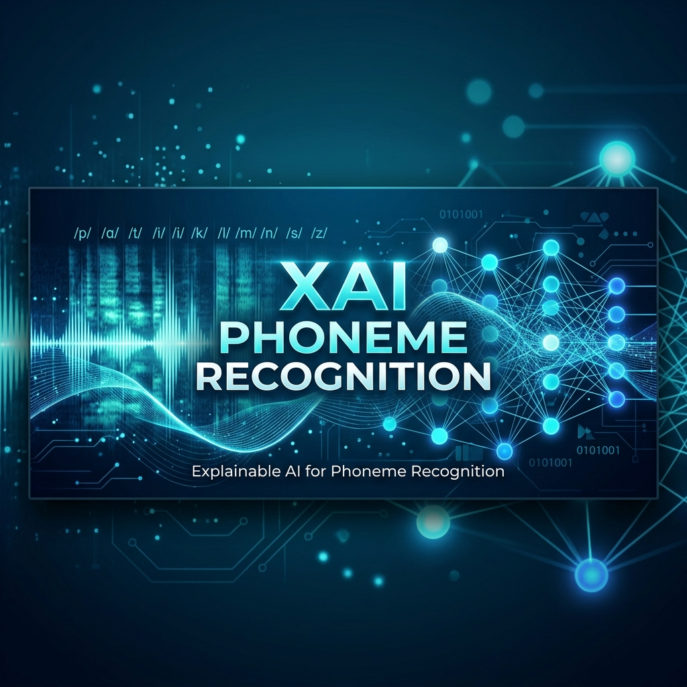

# XAI Phoneme Recognition



[](https://www.python.org/)
[](https://pytorch.org/)
[](https://huggingface.co/patrickvonplaten/wav2vec2-base-timit-fine-tuned)
[](LICENSE)

This repository reproduces and extends the analysis from:
**"Can We Trust Explainable AI Methods on ASR? An Evaluation on Phoneme Recognition"** (Wu et al., Interspeech 2023).

## Overview

The project evaluates Local Interpretable Model-agnostic Explanations (LIME) for Automatic Speech Recognition (ASR) phoneme recognition on the TIMIT dataset. Three LIME variants are analyzed:

- Base LIME
- LIME-WS (Window-Segment)
- LIME-TS (Time-Segment)

## Key Contributions

- Replaces a legacy Kaldi-based backend with Hugging Face Wav2Vec2 for CTC phoneme recognition.
- Uses ONNX Runtime GPU (`CUDAExecutionProvider`) for modern NVIDIA hardware compatibility.
- Reports substantial improvement over the reference paper for Base LIME and LIME-WS at `Validity@3`.
- Identifies `90 ms` segment duration as a strong setting under this experimental setup.

## Evaluation Results

Evaluated with `500` samples, `90 ms` segment duration, and `300 ms` window size.

| Methodology | V@1 | V@3 | V@5 | vs. Paper (V@3) |
| :--- | :---: | :---: | :---: | :---: |
| Base LIME | 0.50 | 0.91 | 0.95 | +47% |
| LIME-WS | 0.48 | 0.92 | 0.96 | +21% |
| LIME-TS | 0.59 | 0.92 | 0.97 | Comparable |
| Random Baseline | 0.02 | 0.07 | 0.12 | - |

### Gender-Based Validity Analysis

| Gender | Method | V@1 | V@3 | V@5 |
| :--- | :--- | :---: | :---: | :---: |
| Female | LIME-TS | 0.584 | 0.922 | 0.964 |
| Male | LIME-TS | 0.592 | 0.926 | 0.971 |

## Requirements

- OS: Windows 11
- GPU: NVIDIA RTX 5000 series (Blackwell architecture)
- Python: 3.10.x
- Inference stack: ONNX Runtime GPU + Optimum

## Installation

```bash
pip install transformers torchaudio scikit-learn scipy matplotlib seaborn pandas numpy tqdm statsmodels optimum onnxruntime-gpu
```

## Repository Structure

```text
assets/                                 # Project media
Paper/                                  # Reference paper(s)
XAI_ASR_Phoneme_Recognition.ipynb       # Primary notebook
XAI_ASR_Phoneme_Recognition_Updated.ipynb
README.MD                               # Documentation
```

## Methodology

The evaluation pipeline follows a black-box approach:

1. Preprocess TIMIT audio to `16 kHz` and apply Lee & Hon `61 -> 39` phoneme mapping.
2. Apply segment-based perturbations to generate local surrogate samples.
3. Compute validity metrics from phoneme probability shifts.
4. Run statistical significance testing (including Tukey HSD) to compare methods.

## Reference

Wu, J., et al. *Can We Trust Explainable AI Methods on ASR? An Evaluation on Phoneme Recognition.* Interspeech, 2023.

## License

This project is licensed under the MIT License. See [LICENSE](LICENSE).
